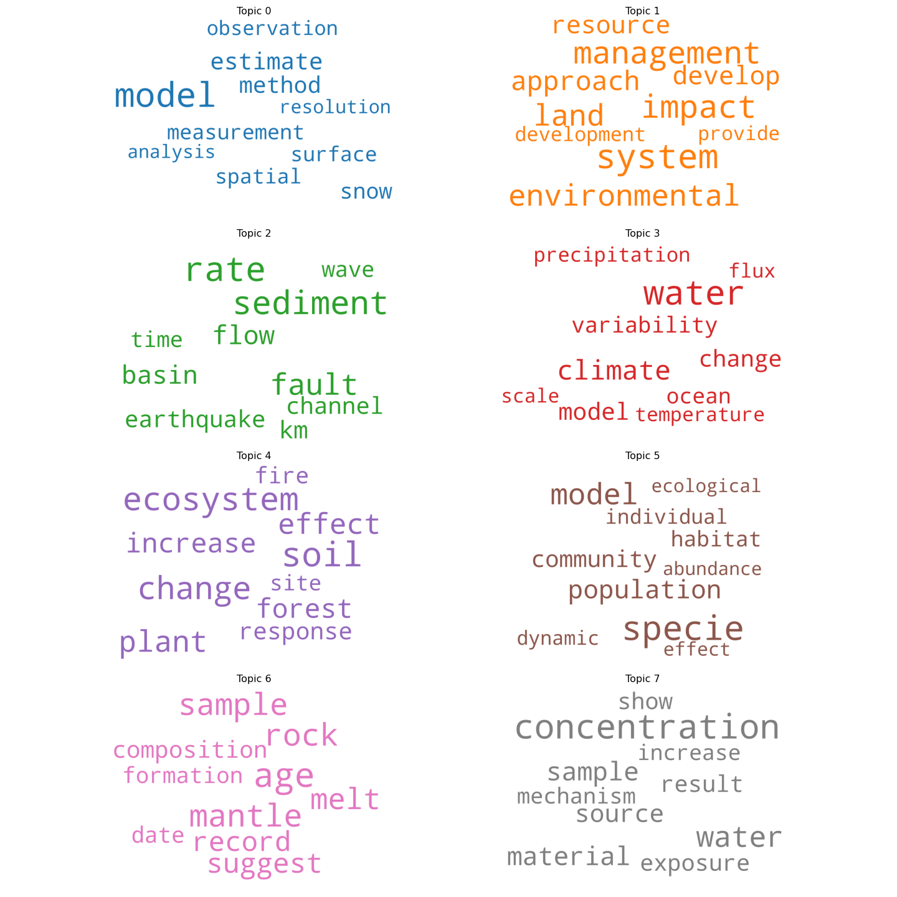
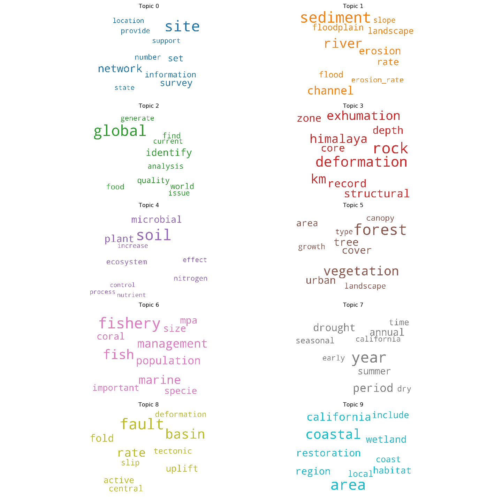

# Designing Multi-Level Spatial Views of Research Themes
In this project, we determine major research topics at UC Santa Barbara's Earth Research Institute ([ERI](https://www.eri.ucsb.edu/)) and visualize their evolution over the last decade. Our goal is to complement conventional, scientometric approaches for reviewing a body of research with systematic, qualitative approaches. We first create meaningful abstractions of the body of research with topic modeling; we then use these topic models to map the body of research. The maps that we design are multi-level, showing views of ERI's research at multiple levels of thematic granularity, which support the academic review process. 

## Heuristics and data sources
We analyze funded projects and publications from ERI's **240** principal investigators (PIs) active from **2009 - 2019**. ERI maintains records of active PIs and funded projects. PI publications come from the [Dimensions API](https://www.dimensions.ai/). Only funded projects or publications with titles and abstracts are analyzed, resulting in a corpus of **3,770** research documents (3,108 publications and 662 funded projects). 

**Scientometric Heuristics**: To determine a suitable range of topics to model, we first survey ERI's: 1) fields of research (from publications); 2) funding agencies (of projects); and 3) academic departments (of affiliated PIs). These measures do not capture the "aboutness" of ERI's research in terms of subjects or methods; thus they do not help to approximate a range of topics to model. However, these measures do highlight the multidisciplinarity of ERI's research portfolio and give a sense of its underlying shape.

- *Fields of research (FOR)*: University administrators or external funding agencies are often concerned with how research units are relatively positioned or compare externally across universities. Classification systems like FOR enable the comparison of resesearch across academic divisions. Publications are classified hierarchically into [(fields of research](https://dimensions.freshdesk.com/support/solutions/articles/23000018826-what-is-the-background-behind-the-fields-of-research-for-classification-system-) representing 22 divisions (broad subject areas or research disciplines) and 157 groups (detailed subsets of divisions). The publication database ([Dimensions.ai](https://dimensions.ai)) assigns FOR codes at the level of the individual article. Publications authored by ERI PIs represent **19 divisions**  and **112 groups** of academic research. The majority of ERI's research falls into just 4 divisions (summarized below). 

- *Funding agencies*: ERI projects have received $191,235,929 over the past decade from **145 funding agencies**. Funders are classified into **5 categories**: Federal agencies; institutes of higher education; private agencies and foundations; California state and municipal agencies; and UC-wide funding. Funding agencies do not clearly signal an appropriate range of topics, but they do offer insights into the type of research being done (e.g. basic, applied). The 20 agencies that have funded the greatest number of ERI projects (summarized below) represent a mixture of sources. 

- *Academic departments*: Over the last decade, ERI's 240 PIs have been affiliated with **24 academic departments**. Some affiliations have also changed (e.g. Crustal Studies has merged into other academic departments). Department affiliations is likely the weakest proxy for estimating a range of research topics since researchers from many disciplines may touch on similar subjects or use similar methods; for example, some expected affiliations, like statistics are conspicuously absent. Many PIs are solely affiliated with ERI, while others are secondarily affiliated (summarized below).

**Cognitive Heuristics**: By contrast, these heuristics reflect "meaningful units" of information (levels of thematic granularity) that a viewer (such as an external reviewer) has in mind. They seem to be better suited to our task of defining and designing a suitable range of topics to model.

- *Miller's law*: The average person can hold approximately 7±2 "chunks" in working memory (e.g. 7 digits, 6 letters, 5 words), limiting the transmission and processing of information (Miller, 1956). This suggests at least two levels of granularity for our topic models, with the coarsest granularity level of 7±2 (**5 - 9 chunks)** and the second level bounded by (5 x 5) to (9 x 9), a range of (**25 - 81 chunks**). 

## Natural Language Processing
We prepare the documents (titles and abstracts) for topic modeling by: removing records with identical identifiers (DOIs), removing HTML tags, and reformatting ASCII extended characters. Documents range in length from 128 - 7,083 characters; the mean length is 1,678 characters.

We determine distinct document terms from the corpus using term frequency–inverse document frequency (tf-idf). From these, we determine generic terms that qualify as stopwords and are stripped from the documents. The 20 most distinctive (and possibly important) words in the corpus of documents, along with their tf-idf weights, are:

1. data (72.55)
2. water (68.59)
3. species (67.42)
4. climate (64.61)
5. model (59.18)
6. soil (54.52)
7. snow (48.71)
8. change (47.67)
9. high (44.43)
10. surface (44.21)
11. based (42.98)
12. models (41.48)
13. ocean (38.30)
14. carbon (38.21)
15. spatial (37.74)
16. land (37.37)
17. results (36.83)
18. global (36.81)
19. california (36.53)
20. environmental (36.39)

Next, we follow a standard natural language processing pipeline (Bird et al., 2009) to reformat the documents into a dictionary and a corpus: 

1. extension of the stopword list to remove frequent, generic terms determined by tf-idf ('data', 'study', 'project', 'research', 'collaborative', 'include', 'result', 'increase', 'high', 'low', 'large', 'include', 'based');
2. tokenization, conversion to lowercase, and construction of n-gram models (bigrams, trigrams) to preserve contiguous sequences of words (e.g. 'climate_change'); 
3. and lemmatization to resolve words to their base forms (e.g. 'specie') 

From the processed documents, we create a dictionary (of word ids, word frequencies) and a corpus (a bag of words, shown as a word cloud below) to use in topic modeling.

 

## Topic Modeling
Topic modeling reveals research topics unbounded by traditional silos (e.g. fields of research, funding agencies, academic departments). We experiment with several unsupervised approaches to develop coherent topic models. We consider the most important parameter of each model to be its *number of topics*. In addition to model coherence scores or measures of perplexity, we also consider the previously reported heuristics to determine a range of topics to test. 

We take two kinds of topic modeling approaches: *probabilistic* (LDA, hLDA) and *matrix factorization* (NMF). In probabilistic approaches, each document is treated as a mixture of a small number of topics; words and documents get a probability score for each topic (Blei, 2003). In matrix factorization approaches, methods from linear algebra are applied to decompose a document-term matrix (tf-idf) into a smaller set of matrices, which can be interpreted as a topic model (Lee and Seung, 1999). 

In addition to the scientometric and cognitive heuristics we previously developed, we also report *coherence scores* for the topic models, which allow model comparison and evaluation across levels of thematic granularity. Coherence measures the extent to which top terms representing a topic are semantically related relative to the corpus (Greene et al., 2014). This measure allows us to select a model with a number of topics yielding a relatively high coherence score. Compared with similar measures, including perplexity and log-likelihood, for evaluating topic model quality, coherence is considered to be more human interpretable. 

### Latent Dirichlet Allocation (LDA)
The LDA algorithm (Blei et al., 2003) is a generative probabilistic model. In each run of LDA, we set the random seed to 1, ensuring model reproducibility. The [MALLET](http://mallet.cs.umass.edu./) implementation of LDA (McCallum, 2002) produced higher quality topics than the Gensim and Scikit-learn implementations. We determined a sensible number of topics to test (2 - 100) based on the previously established heuristics and iterated through these to determine models yielding the highest coherence scores.

Following our heuristics, the model with the highest coherence score in the first level of thematic granularity (between 5 - 9 topics) has **8 topics** and the model with the highest coherence score in the second level (between 25 - 81 topics) has **43 topics**. The findings are summarized below.

Number of Topics| Coherence Score (0 - 1) | 
|-------------:|-------------:|------:|
| **43** | **0.5444**  |
| 47 |0.5376 | 
| 55 |0.5347  | 
| 67 |0.5330 | 
| 52 |0.5328 | 
| **8** | **0.4657** | 
| 9|0.462| 
| 7 |0.4576 | 
| 5|0.4317  | 
| 6|0.4292 | 

Wordclouds summarizing the first 10 topics of the model and the top 10 keywords for both models are shown below. Keywords are weighted within the topic and sized accordingly in each topic's wordcloud.

*8 topic word cloud:*

*43 topic word cloud:*

We produce interfaces to the topic models using [pyLDAvis](https://nbviewer.jupyter.org/github/bmabey/pyLDAvis/blob/master/notebooks/pyLDAvis_overview.ipynb). The browser-based tool offers a interactive visualization of topics estimated with LDA. The distance between topics (Jensen-Shannon divergence) is computed and multidimensional scaling (principal components) projects the intertopic distances onto two dimensions. The size of topics and their distributions, as well as the saliency of terms within each topic and across the entire corpus, are visible. As a result, pyLDAvis supports interpretation of: 1) the meaning of each topic; 2) the prevalence of each topic; and 3) the relationship among topics (Sievert and Shirley, 2014). 

*8 topic pyLDAvis:*

*43 topic pyLDAvis:*

### Hierarchical LDA (hLDA)

An extension of LDA for learning topic hierarchies is hLDA (Griffiths et al., 2004). This approach estimates the structure of a hierarchy and partitions documents nonparametrically. We use an hLDA implementation from [Tomotopy](https://bab2min.github.io/tomotopy). The following summarizes our findings at several hierarchical levels. The hierarchical model with a depth of 4 has the lowest perplexity score, a measure of how well a probability model predicts a sample for a given number of topics. 

The model producing the lowest perplexity score is the **4-level** hierarchical model. The first level of all models is **1 "parent" topic**. Interpreting the number of topics per level using our heuristics, the second level of the 4-level model has **29 topics**, which is within the suitable range of topics that we predicted (25 - 81). Extending Miller's Law to a third and fourth level, a suitable range of topics for each would fall between ((5 x 5 x 5) to (9 x 9 x 9)) and ((5 x 5 x 5 x 5) to (9 x 9 x 9 x 9)) respectively. Neither the third nor fourth levels however fall within these predicted ranges; **83 topics** (125 - 729) and **409 topics** (625 - 6561). The findings from hierarchical models between 3 - 9 levels of depth are summarized below.

| Depth | Total Topics | Number of Topics per Level| Perplexity Score |
|----------|-------------:|------:|------:|
| 3|  393 | 1, 80, 312    | 3921.60 | 
| **4**|  **522** | **1, 29, 83, 409**     | **3622.80** | 
| 5|  555 | 1, 15, 39, 97, 403     | 3645.70 | 
| 6|  742 | 1, 17, 31, 69, 167, 457     | 3697.96 | 
| 7|  662 | 1, 8, 15, 32, 55, 134, 417    | 3928.90 | 
| 8|  807 | 1, 4, 12, 21, 39, 77, 166, 487    | 3867.75 | 
| 9|  1077 | 1, 5, 9, 11, 32, 77, 121, 243, 578   | 3996.23 | 

An example of topics taken from each level of the 4-levels is shown below. Each topic is a node labeled with its top 10 keywords. The edges are weighted by the number of documents assigned to each topic. 

### Non-negative Matrix Factorization (NMF)
The NMF approach (Arora, 2013) relies on linear algebra and has been shown to produce higher quality topics for smaller or sparser datasets. We generated the NMF models using [Scikit-learn](https://medium.com/mlreview/topic-modeling-with-scikit-learn-e80d33668730) and used an initialization procedure called Nonnegative Double Singular Value Decomposition (nndsvd), which is best for sparse data. We fit [model parameters](https://github.com/derekgreene/topic-model-tutorial/) using tf-idf (term frequency–inverse document frequency) features. We tested the same range of topics (2 - 100) as we did previously with LDA to determine models yielding the highest coherence scores. NMF produced models with higher coherence scores than the LDA models. 

Following our heuristics, the model with the highest coherence score in the first level of thematic granularity (between 5 - 9 topics) has **9 topics** and the model with the highest coherence score in the second level (between 25 - 81 topics) has **70 topics**. The findings are summarized below. 

| Number of Topics| Coherence Score (0 - 1) |
|-------------:|------:|
| **70** | **0.7077** |
| 71 | 0.7063 |
| 74 | 0.7069 |
| 80 | 0.705 |
| 82 | 0.7064 |
| **9** | **0.5966** |
| 8 | 0.5828 |
| 7 | 0.5576 |
| 6 | 0.5200 |
| 5 | 0.5009 |

## ~Spatialization

[Rationale for selecting a "family" of topic models most suited to our task...] The models yield three main units around which the spatializations can be oriented:

- topics
- documents (publications, projects)
- PIs

Using the topic models we selected at each level of thematic granularity, we develop spatial views of ERI's body of research. We structure these views along the lines of Franco Moretti's (2007) abstract models for literary history, which support "distant reading" of the corpus. 

- **Graphs:** objects, event (time) RIDGELINE; PI-topics changing over time
- **Maps:** field (space) t-SNE (Maaten and Hinton, 2008); PI-document distribution in a topic space
- **Trees:** network (combination of both) DENDROGRAM; Topic/document clustering

While there are many possible configurations resulting from this, our primary goal is to map each of ERI's PIs in a topic space. We develop a prototype dashboard with [Plotly Dash](https://plotly.com/python/) as an interface to the models we develop. We use this to survey ERI PIs.

## References

Arora, S., Ge, R., Halpern, Y., Mimno, D., Moitra, A., Sontag, D., ... and Zhu, M. (2013). A practical algorithm for topic modeling with provable guarantees. In International Conference on Machine Learning (pp. 280-288).

Bird, S., Loper, E., and Klein, E. (2009). Natural Language Processing with Python. O’Reilly Media Inc.

Blei, D. M., Ng, A. Y., and Jordan, M. I. (2003). Latent dirichlet allocation. Journal of machine Learning research, 3(Jan), 993-1022.

Chase, W. G., & Simon, H. A. (1973). Perception in chess. Cognitive psychology, 4(1), 55-81.

Dunbar, R. I. (1992). Neocortex size as a constraint on group size in primates. Journal of human evolution, 22(6), 469-493.

Greene, D., O’Callaghan, D., & Cunningham, P. (2014). How many topics? stability analysis for topic models. In Joint European Conference on Machine Learning and Knowledge Discovery in Databases (pp. 498-513). Springer, Berlin, Heidelberg.

Griffiths, T. L., Jordan, M. I., Tenenbaum, J. B., and Blei, D. M. (2004). Hierarchical topic models and the nested chinese restaurant process. In Advances in neural information processing systems (pp. 17-24).

Maaten, L. van der, and Hinton, G. (2008). Visualizing data using t-SNE. Journal of Machine Learning Research, 9(Nov), 2579–2605.

McCallum, Andrew Kachites. (2002). "MALLET: A Machine Learning for Language Toolkit." http://mallet.cs.umass.edu.

Miller, G. A. (1956). The magical number seven, plus or minus two: Some limits on our capacity for processing information. Psychological review, 63(2), 81.

Norman, D. A. (1986). Cognitive engineering. User centered system design, 31, 61.

Shneiderman, B. (1992). Tree visualization with tree-maps: 2-d space-filling approach. ACM Transactions on graphics (TOG), 11(1), 92-99.

Sievert, C., and Shirley, K. (2014). LDAvis: A method for visualizing and interpreting topics. In Proceedings of the workshop on interactive language learning, visualization, and interfaces (pp. 63-70).