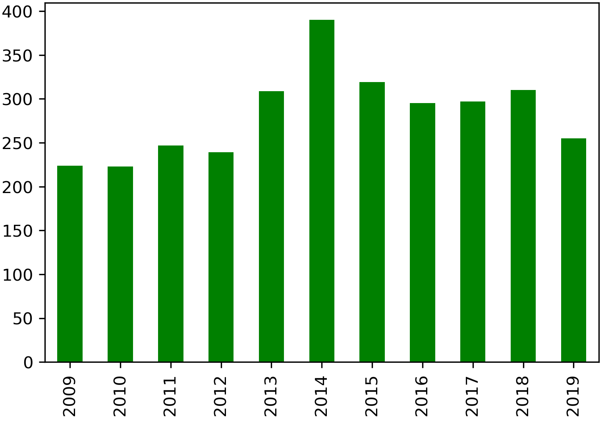
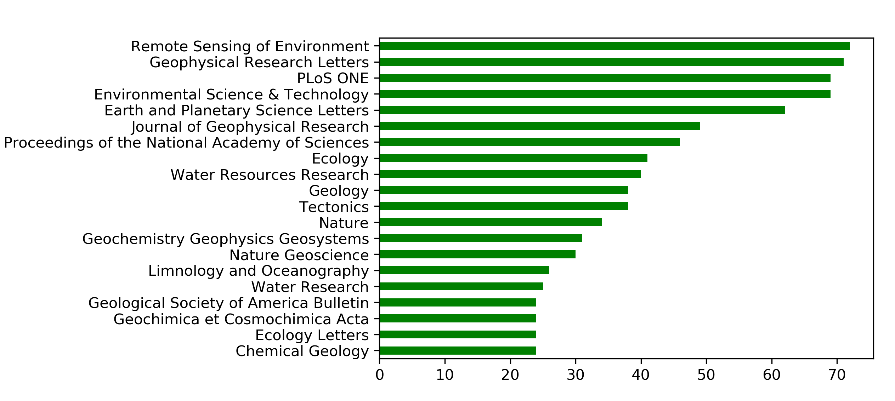
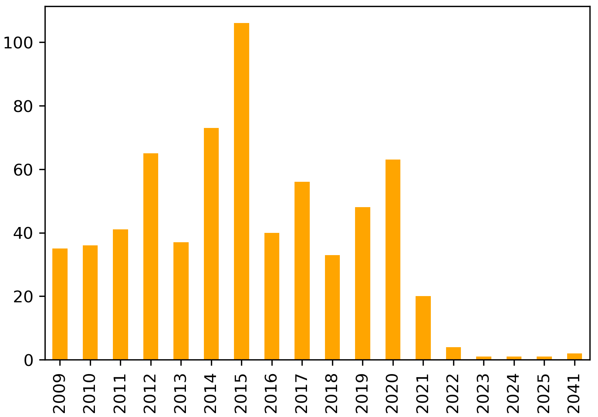

# Discovering Earth Research Topics
This project determines major research topics at UC Santa Barbara's Earth Research Institute ([ERI](https://www.eri.ucsb.edu/)) and visualizes their evolution over the last decade. Data analyzed include ERI's funded projects and publications from **240** principal investigators (PIs) active from **2009 - 2019**. ERI maintains records of active PIs and funded projects. Published articles by active PIs were harvested from the [Dimensions API](https://www.dimensions.ai/). The list of published articles obtained were hand-curated by ERI administrative staff. Only funded projects or publications with titles and abstracts were considered, resulting in a corpus of 3,108 publications and 662 funded projects (**3,770** research documents). 

## Data
We report summary statistics for ERI's publications, funded projects, and PIs with the goal of determining a suitable range of topics for modeling and evaluating topic model coherence. This summary also highlights the multidisciplinarity of ERI's research portfolio. 

**Fields of research (for publications):**

The distribution of publications (shown in green) by year of publication is shown below.

Publications are classified hierarchically into [fields of research (FOR)](https://dimensions.freshdesk.com/support/solutions/articles/23000018826-what-is-the-background-behind-the-fields-of-research-for-classification-system-) representing 22 divisions and 157 groups. Divisions represent a broad subject area or research discipline and groups are detailed subsets of divisions. The publication database ([Dimensions.ai](https://dimensions.ai)) assigns FOR codes at the level of the individual article, rather than by journal classification. Publications authored by ERI PIs represent **19 divisions** (summarized below) and **112 groups** of academic research.

ERI PIs have published in **638 journals** over the past decade. The 20 journals in which ERI researchers published most (summarized below) cross disciplinary boundaries.

**Funding agencies (for projects):**

The distribution of funded projects (shown in orange) by the last year of funding is shown below.

ERI projects have been funded $191,235,929 over the past decade by **145 agencies**. Funders are classified into **5 categories**: Federal agencies; institutes of higher education; private agencies and foundations; California state and municipal agencies; and UC-wide funding. The 20 agencies that have funded the greatest number of ERI projects (summarized below) represent a mixture of sources. 

**Academic departments (for PIs):**

Over the last decade, ERI's 240 PIs have been affiliated with **24 academic departments**. Many PIs are solely affiliated with ERI, while others are secondarily affiliated (as shown below). Some affiliations have also changed (e.g. Crustal Studies has morphed into other academic departments).

## Preprocessing
Text cleaning involved: removing records with identical identifiers (DOIs), removing HTML tags, and reformatting ASCII extended characters. Analysis of the cleaned text showed a range of document lengths (title, abstract): the shortest is 128 characters, the longest document is 7,083 characters, and the mean document length is 1,678 characters.

## Natural Language Processing
To prepare the documents for topic modeling, we followed a standard natural language processing pipeline (Bird et al., 2009) with the goal of reformatting the documents into a dictionary and a corpus: 

1. extension of the stopword list to remove frequent and generic terms ('data', 'study', 'project', 'research', 'collaborative');
2. tokenization and conversion to lowercase, construction of n-gram models to preserve contiguous sequences of words (bigrams, trigrams); 
3. and lemmatization to resolve words to their base forms. 

From the processed documents, we created a dictionary (of word ids, word frequencies) and a corpus (a bag of words) to use in topic modeling.

## Topic Modeling
We experimented with several unsupervised approaches to develop coherent topic models. The most important parameter of each model is its number of topics. In addition to model coherence scores or log-likelihoods, we also considered the previously reported heuristics to determine a range of topics to test. 

Based on these heuristics, we predict that a model with approximately 20 topics could sufficiently capture the diversity of ERI's areas of research and methods. Topic modeling reveals research topics unbounded by traditional silos (e.g. fields of research, funding agencies, academic departments). 

We experiment with two kinds of topic modeling approaches: probabilistic (LDA) and matrix factorization (NMF). In probabilistic approaches, each document is treated as a mixture of a small number of topics; words and documents get a probability score for each topic (Blei, 2003). In matrix factorization approaches, methods from linear algebra are applied to decompose a document-term matrix (tf-idf) into a smaller set of matrices, which can be interpreted as a topic model (Lee and Seung, 1999). NMF is regarded as more stable and scalable than LDA, but running times can increase considerably as the number of topics increases (Greene et al., 2014).

### Latent Dirichlet Allocation (LDA)
We experimented with several implementations of the LDA algorithm (Blei et al., 2003) summarized below. LDA is a generative probabilistic model. In each run of LDA, the random seed or random state was set to 1, ensuring model reproducibility. We iterated through models with a sensible range of topics (2 - 100) based on the previously established heuristics to determine which models yield the highest coherence scores. 

We determined that the [MALLET](http://mallet.cs.umass.edu./) implementation of LDA (McCallum, 2002) produced higher quality topics than the Gensim and Scikit-learn implementations. We deployed pyLDAvis interfaces for the most coherent models at several levels of thematic granularity and generated: 

1. the most representative document for each topic; 
2. the topic distribution across documents; 
3. and the dominant topic for each document. 

**LDA Coherence:**

Number of Topics| Coherence Score (0 - 1) | pyLDAvis |
|-------------:|------:|------|
| 43 | 0.5444 |[lda-mallet-43.html](https://github.com/saralafia/Study-3-master/blob/master/pyLDAvis/lda-mallet-20.html)
| 55 | 0.5347 |[lda-mallet-55.html](https://github.com/saralafia/Study-3-master/blob/master/pyLDAvis/lda-mallet-55.html)
| 67 | 0.5330 |[lda-mallet-67.html](https://github.com/saralafia/Study-3-master/blob/master/pyLDAvis/lda-mallet-67.html)
| 24 | 0.5330 |[lda-mallet-24.html](https://github.com/saralafia/Study-3-master/blob/master/pyLDAvis/lda-mallet-24.html)
| **20** | **0.5014** |[lda-mallet-20.html](https://github.com/saralafia/Study-3-master/blob/master/pyLDAvis/lda-mallet-20.html)

**LDA Results (20 Topic Model):**

A wordcloud of the top 10 keywords from the 10 most significant topics is shown below. 

The top 10 keywords from all 20 topics (unlabeled and unordered) are shown below. The topics can be compared with the NMF model of the same thematic granularity (presented in the next section).

Topic| Keywords |
|:---|:------|
| 0	| management, conservation, fishery, resource, risk, human, approach, climate_change, strategy, ecosystem|
| 1 |	high, increase, low, result, temperature, show, compare, difference, decrease, suggest |
|2	|age, record, rock, date, early, ice, core, monazite, formation, ca|
|3	|sediment, river, rate, flow, watershed, channel, basin, stream, erosion, landscape|
|4	|model, scale, spatial, base, approach, predict, estimate, develop, method, distribution|
|5	|process, system, understand, study, role, important, structure, provide, complex, interaction|
|6	|specie, population, community, effect, diversity, abundance, individual, ecosystem, biomass, find|
|7	|snow, surface, satellite, measurement, observation, estimate, algorithm, product, soil_moisture, water|
|8	|work, include, system, field, program, develop, provide, analysis, site, year|
|9	|soil, plant, ecosystem, forest, fire, water, effect, increas, drought, vegetation|
|10|	base, map, area, resolution, vegetation, spatial, analysis, image, type, mapping|
|11	|earthquake, wave, velocity, source, seismic, large, structure, km, observation, depth|
|12|	water, concentration, effect, method, source, environmental, sample, groundwater, release, natural|
|13|	climate, change, precipitation, variability, climate_change, event, rainfall, trend, region, response|
|14|	ocean, water, flux, lake, surface, measurement, carbon, concentration, global, estimate|
|15|	mantle, source, melt, composition, sample, high, low, isotope, ratio, earth|
|16|	impact, water, environmental, production, change, result, energy, land_use, reduce, urban|
|17|	california, area, coastal, habitat, site, provide, include, large, support, restoration|
|18|	mechanism, level, cell, plant, response, growth, material, form, enhance, oil|
|19|	fault, rate, basin, km, fold, central, deformation, tectonic, time, range|

### Non-negative Matrix Factorization (NMF)
We also experimented with an NMF implementation (Arora, 2013) for comparison. NMF relies on linear algebra and has been shown to produce higher quality topics for smaller or sparser datasets. Iterations through through models with topics (2 - 100) determined models yielding the best coherence scores. 

We generated the NMF models using [Scikit-learn](https://medium.com/mlreview/topic-modeling-with-scikit-learn-e80d33668730). We implemented NMF with an initialization procedure called Nonnegative Double Singular Value Decomposition (nndsvd), which is best for sparse data. We fit [model parameters](https://github.com/derekgreene/topic-model-tutorial/) using tf-idf (term frequency–inverse document frequency) features. 

**TF-IDF Document-Terms:** 

The top 20 distinct terms from the corpus with their tf-idf scores are shown below.

1. data (72.55)
2. water (68.59)
3. species (67.42)
4. climate (64.61)
5. model (59.18)
6. soil (54.52)
7. snow (48.71)
8. change (47.67)
9. high (44.43)
10. surface (44.21)
11. based (42.98)
12. models (41.48)
13. ocean (38.30)
14. carbon (38.21)
15. spatial (37.74)
16. land (37.37)
17. results (36.83)
18. global (36.81)
19. california (36.53)
20. environmental (36.39)

**NMF Coherence:**

| Topics| Coherence Score (0 - 1) |
|-------------:|------:|
| 100 | 0.7078 |
| 84 | 0.7076 |
| 75 | 0.7060 |
| 90 | 0.7044 |
| **20** | **0.6612** |

**NMF Results (20 Topic Model):** 

The top 10 keywords from all 20 topics (unlabeled and unordered) are shown below.

Topic| Keywords |
|:---|:------|
|1|	climate, change, adaptation, models, future, impacts, land, model, responses, scenarios|
|2|	fault, slip, faults, deformation, basin, rates, zone, uplift, fold, earthquake|
|3	|snow, swe, cover, snowmelt, equivalent, snowpack, model, albedo, covered, sierra|
|4	|soil, moisture, microbial, soils, plant, dry, microwave, surface, roughness, smap|
|5	|ocean, phytoplankton, color, optical, cdom, satellite, data, particle, global, carbon|
|6	|species, diversity, plant, richness, native, biodiversity, communities, biomass, ecosystem, community|
|7	|rupture, earthquake, seismic, ground, wave, motion, velocity, model, waves, earthquakes|
|8|	ma, rocks, crustal, monazite, metamorphism, crust, zircon, metamorphic, exhumation, deformation|
|9	|vegetation, data, land, spectral, cover, lst, microwave, surface, based, modis|
|10|	ice, sea, sheet, antarctic, glacial, ka, greenland, holocene, level, retreat|
|11|	sediment, erosion, rates, 10be, river, channel, fluvial, transport, floodplain, rivers|
|12|	fire, wildfire, fires, burned, severity, burn, post, vegetation, regimes, california|
|13|	carbon, co2, emissions, methane, ch4, lakes, gas, dioxide, amazon, fluxes|
|14|	nanoparticles, cu, enms, nano, nps, nanomaterials, toxicity, zno, tio2, metal|
|15|	water, groundwater, river, streamflow, drought, forest, recharge, floodplain, hydrologic, riparian|
|16|	mantle, lavas, crust, isotopic, geochemical, melt, 3he, samoan, inclusions, subduction|
|17|	rainfall, precipitation, extreme, events, monsoon, mjo, variability, south, oscillation, season|
|18|	management, fisheries, conservation, marine, environmental, fishery, services, policy, ecosystem, research|
|19|	kelp, giant, forest, biomass, forests, pyrifera, macrocystis, spatial, disturbance, california|
|20|	project, restoration, campus, ucsb, slough, open, california, coastal, devereux, habitat|

### Hierarchical LDA (hLDA)

(Griffiths et al., 2004)

| Implementation | Topics| Coherence Score (0 - 1) |
|----------|-------------:|------:|
| MALLET hLDA |      |  | 

### Other topic models and coherence scores:

* Latent Semantic Indexing (LSI): 5 topics (0.4277)
* Hierarchical Dirichlet Process (HDP): 150 topics (0.4993); topics are determined through posterior inference (hdp-gensim-150.html)

## Visualization

###pyLDAvis (LDA)
The [pyLDAvis](https://nbviewer.jupyter.org/github/bmabey/pyLDAvis/blob/master/notebooks/pyLDAvis_overview.ipynb) browser offers a web-based interactive visualization of topics estimated with LDA. It is intended to answer three questions: 1) What is the meaning of each topic?; 2) How prevalent is each topic?; and 3) How do the topics relate to each other? (Sievert and Shirley, 2014). The distance between topics (Jensen-Shannon divergence) is computed and multidimensional scaling (principal components) projects the intertopic distances onto two dimensions. The size of topics and their distributions, as well as the saliency of terms within each topic and across the entire corpus, are visible. 

The "loading" of principal components (PC1/PC2) are: ****

"Reading" the neighborhoods of the **20 topic model (LDA)**: 

* Geomorphology (Topic 13)...

###t-SNE, wordclouds (NMF)

How to visualize the results of NMF?
(Maaten and Hinton, 2008)

###hierarchical network (hLDA)
""
(Newman, 2010)

## Evaluation

* assign topics (and words?) to every PI
* build an interface (DASH) for surveying ERI PIs
* have ERI PIs evaluate their topc assignment(s)

## References
Arora, S., Ge, R., Halpern, Y., Mimno, D., Moitra, A., Sontag, D., ... and Zhu, M. (2013). A practical algorithm for topic modeling with provable guarantees. In International Conference on Machine Learning (pp. 280-288).

Bird, S., Loper, E., and Klein, E. (2009). Natural Language Processing with Python. O’Reilly Media Inc.

Blei, D. M., Ng, A. Y., and Jordan, M. I. (2003). Latent dirichlet allocation. Journal of machine Learning research, 3(Jan), 993-1022.

Greene, D., O’Callaghan, D., & Cunningham, P. (2014). How many topics? stability analysis for topic models. In Joint European Conference on Machine Learning and Knowledge Discovery in Databases (pp. 498-513). Springer, Berlin, Heidelberg.

Griffiths, T. L., Jordan, M. I., Tenenbaum, J. B., and Blei, D. M. (2004). Hierarchical topic models and the nested chinese restaurant process. In Advances in neural information processing systems (pp. 17-24).

Maaten, L. van der, and Hinton, G. (2008). Visualizing data using t-SNE. Journal of Machine Learning Research, 9(Nov), 2579–2605.

McCallum, Andrew Kachites. (2002). "MALLET: A Machine Learning for Language Toolkit." http://mallet.cs.umass.edu.

Newman, M. E. J. (2010). Networks: An introduction. Oxford University Press.

Sievert, C., and Shirley, K. (2014). LDAvis: A method for visualizing and interpreting topics. In Proceedings of the workshop on interactive language learning, visualization, and interfaces (pp. 63-70).