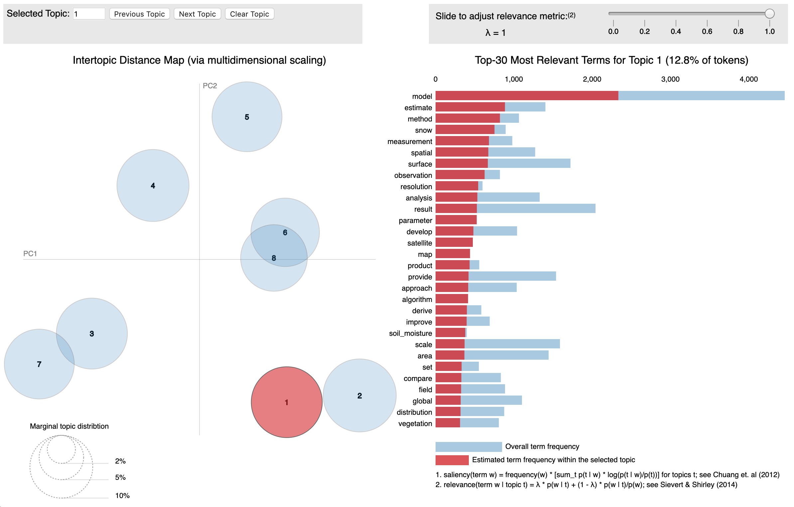
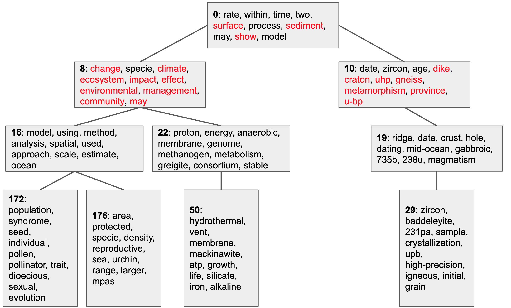
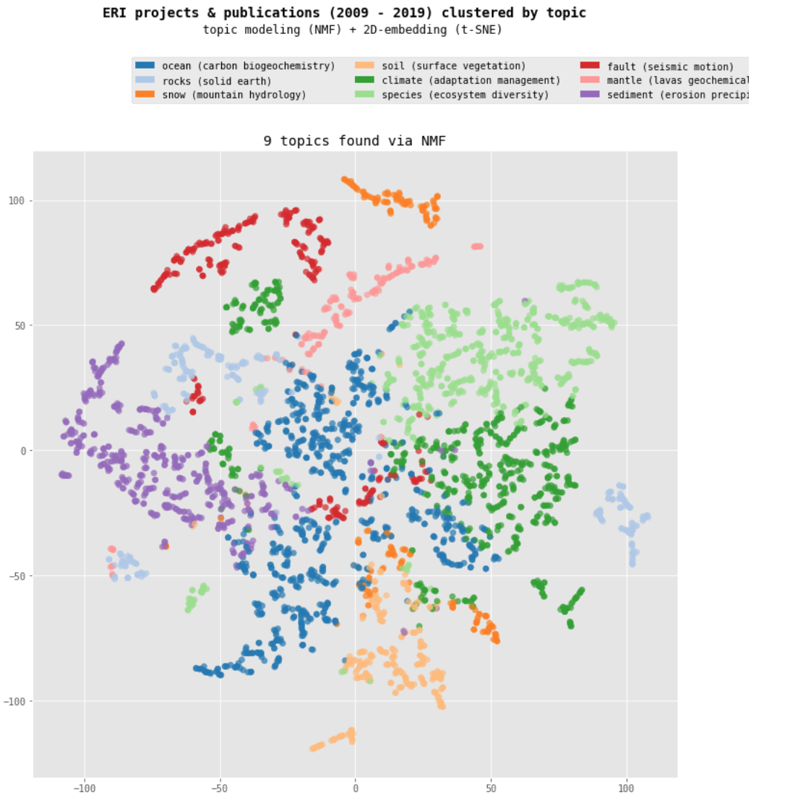
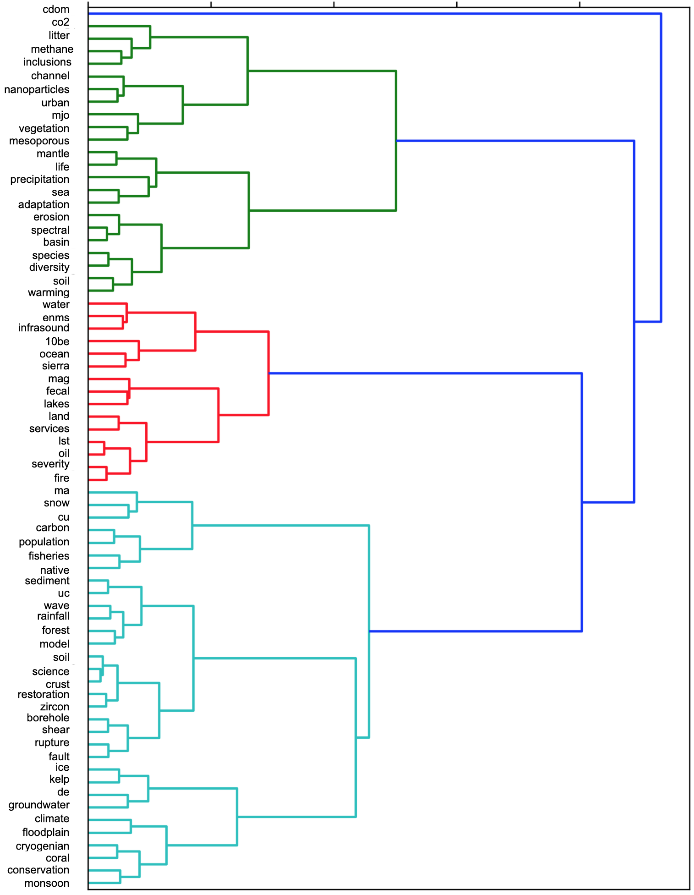

# Designing Multi-Level Spatial Views of Research Themes
The goal of this project is to model research themes studied at UC Santa Barbara's Earth Research Institute [ERI](https://www.eri.ucsb.edu/) and map their evolution over the past decade. We model topics from ERI's research documents and use these models to design maps of research themes. The maps offer spatial views of ERI's body of research at multiple levels of thematic granularity.

[TOC]

## Data sources
We analyze funded projects and publications from ERI's **240** principal investigators (PIs) active from **2009 - 2019**. ERI maintains records of active PIs and funded projects. We gather PI publication metadata from the [Dimensions API](https://www.dimensions.ai/). Only funded projects or publications with titles and abstracts are analyzed, resulting in **3,770** research documents (3,108 publications and 662 funded projects). [Data](https://github.com/saralafia/Study-3-master/tree/master/data) for PIs, projects, and publications are available in this repository. 

## Natural Language Processing
We prepare the documents (titles and abstracts) for topic modeling by removing records with identical identifiers (DOIs), removing HTML tags, and reformatting ASCII extended characters. Documents range in length from 128 - 7,083 characters; the mean document length is 1,678 characters (as shown below). The [script](https://github.com/saralafia/Study-3-master/blob/master/ERI-heuristics.ipynb) used to process the data is available in this repository.

We determine distinct document terms using the measure of term frequency–inverse document frequency, or tf-idf (Salton et al., 1975). We determine frequent terms that are generic and qualify as stopwords; we strip these terms from the documents. The 20 most distinctive words in the documents, along with their relative weights, are:

01. species (53.78)
02. water (53.24)
03. climate (49.46)
04. model (46.09)
05. soil (42.27)
06. snow (37.30)
07. change (36.95)
08. high (35.48)
09. surface (34.62)
10. based (33.88)
11. models (32.29)
12. ocean (30.01)
13. carbon (29.92)
14. results (29.59)
15. spatial (29.49)
16. environmental (29.20)
17. global (29.00)
18. land (28.74)
19. california (28.43)
20. time (28.08)

Next, we follow a standard natural language processing pipeline (Boyd-Graber et al., 2014) to reformat the documents into a dictionary and a corpus: 

1. extension of the stopword list to remove frequent, generic terms determined by tf-idf ('data', 'study', 'project', 'research', 'collaborative', 'include', 'result', 'increase', 'high', 'low', 'large', 'include', 'based');
2. tokenization, conversion to lowercase, and construction of n-gram models (bigrams, trigrams) to preserve contiguous sequences of words (e.g. 'climate_change'); 
3. and lemmatization to resolve words to their base forms (e.g. 'specie') 

From the processed documents, we create a dictionary (of word ids, word frequencies) and a corpus (a bag of words shown as a wordcloud below) to use in topic modeling.

 

## Topic Modeling
We try two kinds of topic modeling approaches: *probabilistic* (LDA, hLDA) and *matrix factorization* (NMF). We report *coherence scores* for the topic models, which allow us to compare models across levels of thematic granularity based on the number of topics (Mimno et al., 2011).

### Latent Dirichlet Allocation (LDA)
The LDA algorithm is a generative probabilistic model in which each document is treated as a mixture of a small number of topics; words and documents get a probability score for each topic (Blei et al., 2003). In each run, we set the random seed to 1, ensuring model reproducibility. We use the [MALLET](http://mallet.cs.umass.edu./) implementation of LDA, which produces higher quality topics than Gensim or Scikit-learn implementations. We iterate through models with 2 - 100 topics to find models with high coherence scores. The findings are summarized below. The LDA [script](https://github.com/saralafia/Study-3-master/blob/master/ERI-LDA.ipynb) is available in this repository.

| Number of Topics| Coherence Score (0 - 1) | 
|-------------:|-------------:|
| **43** | **0.5444**  |
| 47 |0.5376 | 
| 55 |0.5347  | 
| 67 |0.5330 | 
| 52 |0.5328 | 
| **8** | **0.4657** | 
| 9|0.462| 
| 7 |0.4576 | 
| 5|0.4317  | 
| 6|0.4292 | 

To interpret the models, we produce [pyLDAvis](https://nbviewer.jupyter.org/github/bmabey/pyLDAvis/blob/master/notebooks/pyLDAvis_overview.ipynb) interfaces. pyLDAvis supports interpretation of the meaning of each topic, the prevalence of each topic, and the relationships among topics.

[8 topic pyLDAvis](https://github.com/saralafia/Study-3-master/blob/outputs/LDA/lda-mallet-8.html):

[43 topic pyLDAvis](https://github.com/saralafia/Study-3-master/blob/outputs/LDA/lda-mallet-43.html):

### Hierarchical LDA (hLDA)

hLDA is an extension of LDA for learning topic hierarchies; it estimates the structure of a hierarchy and partitions documents nonparametrically  (Griffiths et al., 2004). We implement hLDA with [Tomotopy](https://bab2min.github.io/tomotopy). The following summarizes our findings at several hierarchical levels. The hierarchical model with a depth of 4 has the lowest perplexity score, which measures how well a probability model predicts a sample for a given number of topics. The findings from hierarchical models between 3 - 9 levels of depth are summarized below. The hLDA [script](https://github.com/saralafia/Study-3-master/blob/master/ERI-hLDA.ipynb) is available in this repository.

| Depth | Total Topics | Number of Topics per Level| Perplexity Score |
|----------|-------------:|------:|------:|
| 3|  393 | 1, 80, 312    | 3921.60 | 
| **4**|  **522** | **1, 29, 83, 409**     | **3622.80** | 
| 5|  555 | 1, 15, 39, 97, 403     | 3645.70 | 
| 6|  742 | 1, 17, 31, 69, 167, 457     | 3697.96 | 
| 7|  662 | 1, 8, 15, 32, 55, 134, 417    | 3928.90 | 
| 8|  807 | 1, 4, 12, 21, 39, 77, 166, 487    | 3867.75 | 
| 9|  1077 | 1, 5, 9, 11, 32, 77, 121, 243, 578   | 3996.23 | 

An example from the 4-level model is shown below. Topics are nodes labeled with 10 top keywords and edges (weighted by number of assigned documents) connect parent topics to children topics. 

### Non-negative Matrix Factorization (NMF)
In matrix factorization approaches, methods from linear algebra are applied to decompose a document-term matrix (tf-idf) into a smaller set of matrices, which can be interpreted as a topic model (Lee and Seung, 1999). The NMF approach (Arora et al., 2013) has been shown to produce higher quality topics for smaller or sparser datasets. We generate the NMF models using [Scikit-learn](https://scikit-learn.org/stable/) and use an initialization procedure called Nonnegative Double Singular Value Decomposition (nndsvd), which is appropriate for sparse data (e.g. document titles and abstracts only). We fit the models using tf-idf features and test the same range of topics (2 - 100). The findings are summarized below. The NMF [script](https://github.com/saralafia/Study-3-master/blob/master/ERI-NMF.ipynb) is available in this repository.

| Number of Topics| Coherence Score (0 - 1) |
|-------------:|------:|
| **70** | **0.7077** |
| 71 | 0.7063 |
| 74 | 0.7069 |
| 80 | 0.705 |
| 82 | 0.7064 |
| **9** | **0.5966** |
| 8 | 0.5828 |
| 7 | 0.5576 |
| 6 | 0.5200 |
| 5 | 0.5009 |

Based on the topic models we produce, we adopt the NMF topic modeling approach at two-levels of thematic granularity: **a first level (5-9 topics)** and **a second level (25-81 topics)**. Our approach allows us to dynamically produce topic models with any number of topics within each of these ranges. 

## Spatialization

We try two kinds of spatialization approaches: those that produce *maps* (t-SNE, UMAP) and those that produce *trees* (dendrograms). We show the spatial configurations that result from presenting the high dimensional information from the topic models (NMF). 

### t-distributed stochastic neighbor embedding (t-SNE)

t-SNE (Maaten and Hinton, 2008) is a dimensionality reduction technique developed for mapping high dimensional objects. We generate the maps with [Scikit-learn](https://scikit-learn.org/stable/). We take topic models resulting from non-negative matrix factorization (NMF) and fit them to the tf-idf matrix. We then transform the fitted topic model into a series of coordinates to map with t-SNE. 

The key parameters that we control are *perplexity* (5-50), which defines the number of nearest neighbors, and *early_exaggeration* (default: 12.0), which determines the compactness of resulting clusters and the space between them. We choose a perplexity of 7 and early exaggeration of 5 for the t-SNE map shown below. The t-SNE [script](https://github.com/saralafia/Study-3-master/blob/master/ERI-maps.ipynb) is available in this repository.

### Uniform manifold approximation and projection (UMAP)

We also experiment with UMAP (McInnes et al., 2018) on our data to compare the spatial layout and clustering of UMAP with t-SNE. We use [umap-learn](https://umap-learn.readthedocs.io/en/latest/) to generate the UMAP maps. It scales and preserves global data structure better than t-SNE, in which between-cluster similarities are not always preserved. The process for transforming the non-negative matrix factorization (NMF) and fitting it is nearly identical to that of t-SNE; however, UMAP can work directly with high-dimensional data. 

The key parameters are *n_neighbors* (default=15), which defines the number of neighbors (and is similar to *perplexity* in t-SNE), *min_dist* (default=0.1), which controls how tightly the clusters are packed (and is similar to *early exaggeration* in t-SNE), and *metric* (cosine, euclidean...), which determines how distance is computed. We choose n_neighbors of 10 and min_dist of 0.1. Interactive prototypes of these plots created with [Bokeh](https://docs.bokeh.org/en/latest/index.html) are also available in a [script](https://github.com/saralafia/Study-3-master/blob/master/ERI-maps.ipynb) in this repository.

### Dendrogram

To produce a tree, we select a dendrogram representation, to cluster topics hierarchically. We use [SciPy](https://www.scipy.org/) to generate a dendrogram of topics in the 70 topic model. We use a matrix of the 70 topics and their term weights as an input. From this, we determine a number of aggolmerative clusters for the topics (7). We then generate a linkage dendrogram using a ward method to minimize with euclidean distance between parameters. The dendrogram [script](https://github.com/saralafia/Study-3-master/blob/master/ERI-trees.ipynb) is available in this repository.

## References

Arora, S., Ge, R., Halpern, Y., Mimno, D., Moitra, A., Sontag, D., ... and Zhu, M. (2013). A practical algorithm for topic modeling with provable guarantees. In International Conference on Machine Learning (pp. 280-288).

Blei, D. M., Ng, A. Y., and Jordan, M. I. (2003). Latent dirichlet allocation. Journal of machine Learning research, 3(Jan), 993-1022.

Boyd-Graber, J., Mimno, D., & Newman, D. (2014). Care and feeding of topic models: Problems, diagnostics, and improvements. Handbook of mixed membership models and their applications, 225255.

Griffiths, T. L., Jordan, M. I., Tenenbaum, J. B., and Blei, D. M. (2004). Hierarchical topic models and the nested chinese restaurant process. In Advances in neural information processing systems (pp. 17-24).

Maaten, L. van der, and Hinton, G. (2008). Visualizing data using t-SNE. Journal of Machine Learning Research, 9(Nov), 2579–2605.

McInnes, L., Healy, J., & Melville, J. (2018). Umap: Uniform manifold approximation and projection for dimension reduction. arXiv preprint arXiv:1802.03426.

Mimno, D., Wallach, H. M., Talley, E., Leenders, M., & McCallum, A. (2011, July). Optimizing semantic coherence in topic models. In Proceedings of the conference on empirical methods in natural language processing (pp. 262-272). Association for Computational Linguistics.

Salton, G., Wong, A., & Yang, C. S. (1975). A vector space model for automatic indexing. Communications of the ACM, 18(11), 613-620.