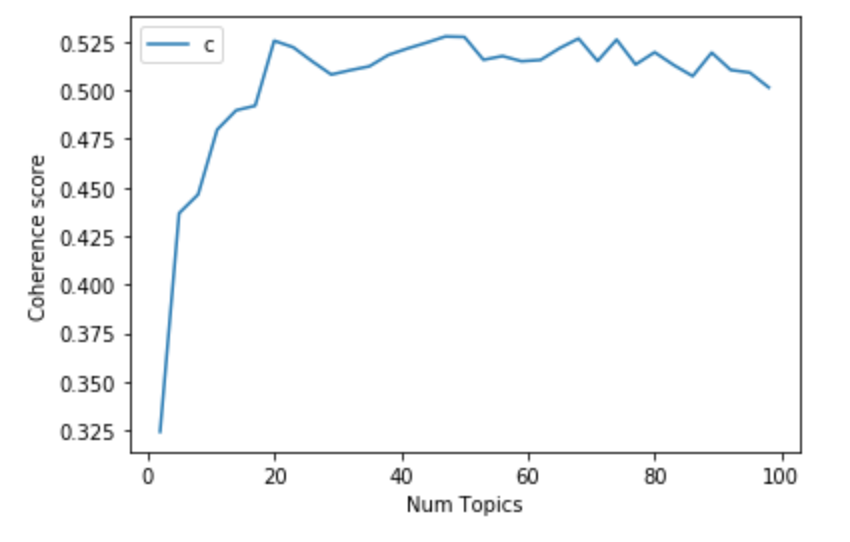

# Discovering and Visualizing Research Topics
The goal of this project is to determine major research topics at UC Santa Barbara's Earth Research Institute ([ERI](https://www.eri.ucsb.edu/)) and visualize how they have changed over the last decade. To determine major topics of research, we analyzed funded projects and publications by ERI researchers from **2009 - 2019**. ERI maintains records of funded projects as well as active principal investigators (PIs). We searched for published articles by active PIs using the [Dimensions API](https://www.dimensions.ai/). The list of published articles we obtained were then hand-curated by ERI administrative staff. Only funded projects or publications with titles and abstracts were considered in our analysis. This resulted in a combined corpus of **3,770 research documents** (3,108 publications and 662 funded projects).

## 1 - Data Preprocessing
Text cleaning involved: removing records with identical identifiers (DOIs), removing HTML tags, and reformatting ASCII extended characters. Analysis of the cleaned text showed: the shortest document (title, abstract) is 128 characters, the longest document is 7,083 characters, and the mean document length is 1,678 characters. Distribution of funded projects and publications showed: the greatest number of publications (431) from 2014; the greatest number of funded projects (78) beginning in 2012; and the greatest number of funded projects (107) ending in 2015.

## 2 - Natural Language Processing
To prepare the documents for topic modeling, we followed standard natural language processing steps (Bird et al., 2009) with the goal of reformatting the documents into a dictionary and a corpus: 

1. extension of the stopword list to remove frequent and generic terms ('data', 'study', 'project', 'research', 'collaborative');
2. tokenization and conversion to lowercase, construction of n-gram models to preserve contiguous sequences of words (bigrams, trigrams); 
3. and lemmatization to resolve words to their base forms. 

From the processed documents, we created a dictionary (of word ids, word frequencies) and a corpus (a bag of words) to use in topic modeling.

## 3 - Topic Modeling
We experimented with several unsupervised approaches to develop coherent topic models. The most important parameter of each model is its number of topics. Heuristics we considered when determining the number of topics, besides model coherence scores or log-likelihoods, were the number of unique:

1. Field of Research Codes associated with ERI publications (****); 
2. UC Santa Barbara home departments of ERI affiliated PIs (****);
3. and labels ERI PIs assign themselves on Google Scholar (****)

Based on these heuristics, we predict that a model with between 5 - 47 topics will capture the diversity of areas of research and methods within ERI. Topic modeling allows us to discover, and ultimately visualize, clusters of research beyond traditional silos (fields of research, departments, or tags). 

### Latent Dirichlet Allocation (LDA)
We experimented with several implementations of the LDA algorithm (Blei et al., 2003) summarized below. The LDA approach is based on probabilistic graphical modeling. In each run of LDA:

1. the random seed or random state was set to ensure model reproducibility;
2. iterations were run through through topics (2 - 100) to determine a number of topics yielding the best coherence score (except for HDP, where topics are determined through posterior inference); 
3. and a pyLDAvis interface showing salient terms was deployed for each model (lda-mallet-47.html, lda-mallet-20.html, lda-gensim-47.html, lda-gensim-14.html, hdp-gensim-150.html, lda-scikitlearn-10.html) supports intepretation by showing salient terms for each of the topics.

**LDA Coherence:**

| Implementation | Topics| Coherence Score (0 - 1) |
|----------|-------------:|------:|
| MALLET LDA | 47 | 0.5277 |
| MALLET LDA | 20 | 0.5256 |
| Gensim LDA |    47   | 0.4499 | 
| Gensim LDA |    14   | 0.4802 | 
| Scikit-learn LDA |    10   | NA**|

** It is not possible to directly obtain a coherence score in this implementation, so instead we report the log-likelihood (-667324.5189)

Overall, we determined that the MALLET LDA implementation (McCallum, 2002) produced higher quality topics. In the MALLET LDA topic model with the highest coherence score, we found: 

1. the most representative document for each topic (LDA-47-rep-doc.csv); 
2. the topic distribution across documents (LDA-47-top-dist.csv); 
3. and the dominant topic for each document (LDA-47-top-doc.csv). 

### Non-negative Matrix Factorization (NMF)
For comparison, we also experimented with an NMF implementation (Arora, 2013). Unlike LDA, the NMF approach relies on linear algebra and has been shown to produce [higher quality topics](https://medium.com/mlreview/topic-modeling-with-scikit-learn-e80d33668730) for smaller or sparser datasets. We selected [parameters](https://github.com/derekgreene/topic-model-tutorial/) by fitting models with tf-idf (term frequency–inverse document frequency) features. All implementations implement [decomposition in Scikit-learn](https://scikit-learn.org/stable/auto_examples/applications/plot_topics_extraction_with_nmf_lda). The first uses an initialization procedure (Nonnegative Double Singular Value Decomposition) that is best for sparse data; the second uses the default beta-loss (Frobenius) as an objective function; and the third (generalized Kullback-Leibler divergence) is another objective function, equivalent to Probabilistic Latent Semantic Indexing. In each run of NMF:

**NMF Coherence:**

| Implementation | Topics| Coherence Score (0 - 1) |
|----------|-------------:|------:|
| Sci-kit learn NMF (init: nndsvd)| 97 | 0.7082 |
| Sci-kit learn NMF (init: nndsvd)| 76 | 0.7072 |
| Sci-kit learn NMF (init: nndsvd)| 21 | 0.6741 |
| Sci-kit learn NMF (beta_loss: Frobenius norm) | |  |
| Sci-kit learn NMF (beta_loss: kullback-leibler) | |  |

### Hierarchical LDA (hLDA)
We experimented with an hLDA implementation, summarized below.   

| Implementation | Topics| Coherence Score (0 - 1) |
|----------|-------------:|------:|
| MALLET hLDA |      |  | 

### Other topic models and coherence scores:
* Latent Semantic Indexing (LSI): 5 topics (0.4470)
* Hierarchical Dirichlet Process (HDP): 20 topics (0.4948); 150 topics (0.4993)

## 4 - Spatialization and Visualization

###pyLDAvis (LDA)
The [pyLDAvis](https://nbviewer.jupyter.org/github/bmabey/pyLDAvis/blob/master/notebooks/pyLDAvis_overview.ipynb) browser uses PCA (or other dimensionality reduction algorithms) to facilitate the exploration of topic models. The size of topics and their distributions, as well as the saliency of terms within each topic and across the entire corpus, are visible in pyLDAvis (Sievert and Shirley, 2014). 

The "loading" of PCA components in pyLDAvis are (PC1/PC2): ****

"Reading" the neighborhoods of the **20 topic model (LDA)**: 

* Geomorphology (Topic 13)...

###t-SNE, wordclouds (NMF)
(Maaten and Hinton, 2008)

###hierarchical network (hLDA)
(Newman, 2010)

## 5 - References
Arora, S., Ge, R., Halpern, Y., Mimno, D., Moitra, A., Sontag, D., ... & Zhu, M. (2013). A practical algorithm for topic modeling with provable guarantees. In International Conference on Machine Learning (pp. 280-288).

Bird, S., Loper, E., and Klein, E. (2009). Natural Language Processing with Python. O’Reilly Media Inc.

Blei, D. M., Ng, A. Y., & Jordan, M. I. (2003). Latent dirichlet allocation. Journal of machine Learning research, 3(Jan), 993-1022.

Maaten, L. van der, & Hinton, G. (2008). Visualizing data using t-SNE. Journal of Machine Learning Research, 9(Nov), 2579–2605.

McCallum, Andrew Kachites. (2002). "MALLET: A Machine Learning for Language Toolkit." http://mallet.cs.umass.edu.

Newman, M. E. J. (2010). Networks: An introduction. Oxford University Press.

Sievert, C., & Shirley, K. (2014). LDAvis: A method for visualizing and interpreting topics. In Proceedings of the workshop on interactive language learning, visualization, and interfaces (pp. 63-70).

## 6 - Next Steps
* aggregate topics up from article to journal level
* check correspondence between labeled topic
* assign topics (and words?) to every PI
* build an interface (DASH) for surveying ERI PIs
* have ERI PIs evaluate their topc assignment(s)