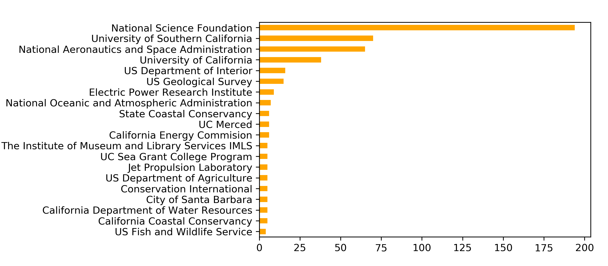
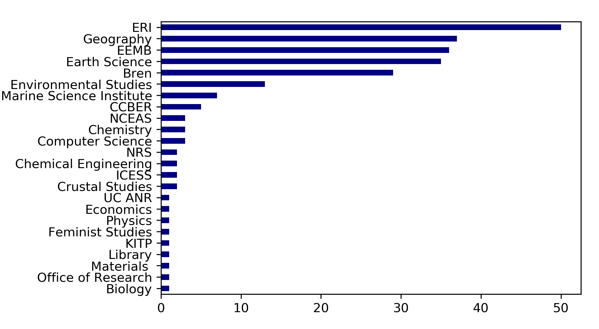
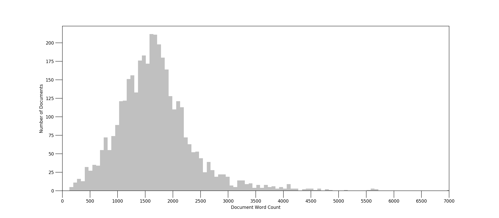
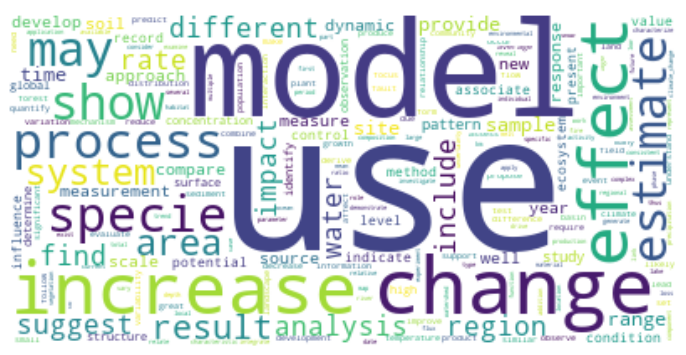
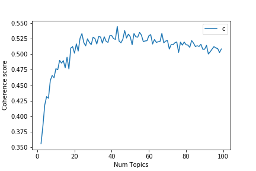
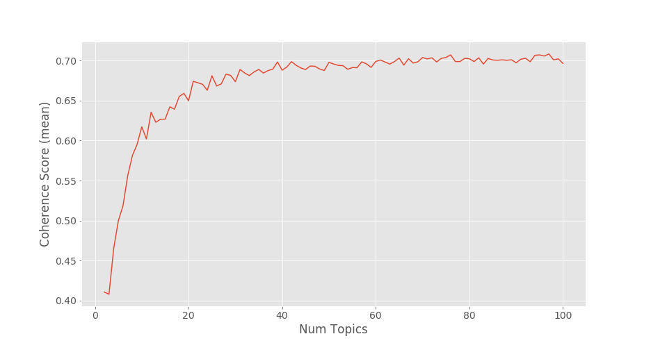
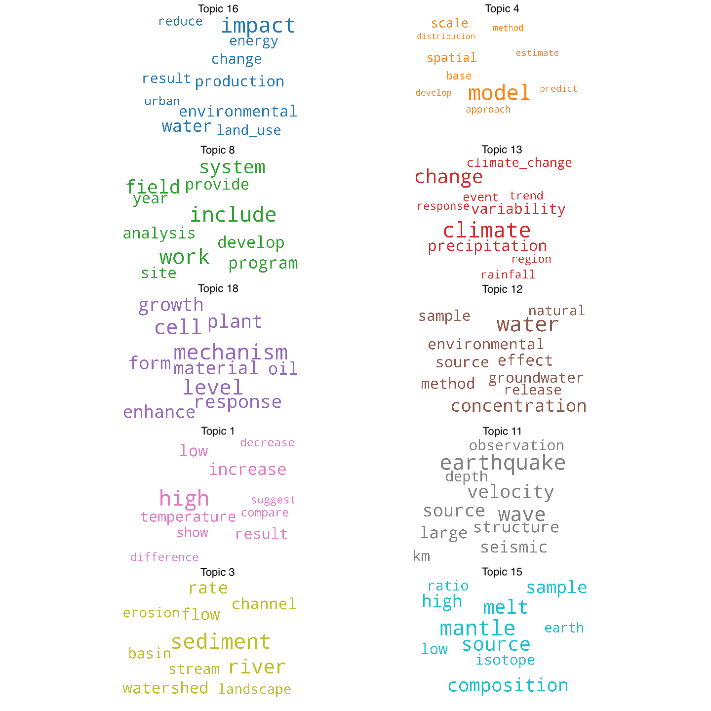

# Designing Adaptive Thematic Views of Research
In this project, we determine major research topics at UC Santa Barbara's Earth Research Institute ([ERI](https://www.eri.ucsb.edu/)) and visualize their evolution over the last decade. Our goal is to complement conventional, scientometric approaches for reviewing a body of research with systematic, qualitative approaches. We first create meaningful abstractions of the body of research with topic modeling; we then use these topic models to map the body of research. The maps that we design are adaptive, showing views of ERI's research at multiple levels of thematic granularity, which support the academic review process. 

## Heuristics and data sources
We analyze funded projects and publications from ERI's **240** principal investigators (PIs) active from **2009 - 2019**. ERI maintains records of active PIs and funded projects. PI publications come from the [Dimensions API](https://www.dimensions.ai/). Only funded projects or publications with titles and abstracts are analyzed, resulting in a corpus of **3,770** research documents (3,108 publications and 662 funded projects). 

**Scientometric Heuristics**: To determine a suitable range of topics to model, we first survey ERI's: 1) fields of research (from publications); 2) funding agencies (of projects); and 3) academic departments (of affiliated PIs). These measures do not capture the "aboutness" of ERI's research in terms of subjects or methods; thus they do not help to approximate a range of topics to model. However, these measures do highlight the multidisciplinarity of ERI's research portfolio and give a sense of its underlying shape.

- *Fields of research (FOR)*: University administrators or external funding agencies are often concerned with how research units are relatively positioned or compare externally across universities. Classification systems like FOR enable the comparison of resesearch across academic divisions. Publications are classified hierarchically into [(fields of research](https://dimensions.freshdesk.com/support/solutions/articles/23000018826-what-is-the-background-behind-the-fields-of-research-for-classification-system-) representing 22 divisions (broad subject areas or research disciplines) and 157 groups (detailed subsets of divisions). The publication database ([Dimensions.ai](https://dimensions.ai)) assigns FOR codes at the level of the individual article. Publications authored by ERI PIs represent **19 divisions**  and **112 groups** of academic research. The majority of ERI's research falls into just 4 divisions (summarized below). 

- *Funding agencies*: ERI projects have received $191,235,929 over the past decade from **145 funding agencies**. Funders are classified into **5 categories**: Federal agencies; institutes of higher education; private agencies and foundations; California state and municipal agencies; and UC-wide funding. Funding agencies do not clearly signal an appropriate range of topics, but they do offer insights into the type of research being done (e.g. basic, applied). The 20 agencies that have funded the greatest number of ERI projects (summarized below) represent a mixture of sources. 

- *Academic departments*: Over the last decade, ERI's 240 PIs have been affiliated with **24 academic departments**. Some affiliations have also changed (e.g. Crustal Studies has merged into other academic departments). Department affiliations is likely the weakest proxy for estimating a range of research topics since researchers from many disciplines may touch on similar subjects or use similar methods; for example, some expected affiliations, like statistics are conspicuously absent. Many PIs are solely affiliated with ERI, while others are secondarily affiliated (summarized below).

**Cognitive Heuristics**: By contrast, these heuristics reflect "meaningful units" of information (levels of thematic granularity) that a viewer (such as an external reviewer) has in mind. They seem to be better suited to our task of defining and designing a suitable range of topics to model.

- *Miller's law* (Miller, 1956): The average person can hold approximately 7±2 objects or digits in working memory, limiting the transmission and processing of information. These objects can be chunked (e.g. 7 digits, 6 letters, 5 words). This range suggests at least two levels of granularity with the coarsest granularity level of **5 - 9 objects** and the second level bounded by **25 - 81 objects**. 
- *Perception in chess* (Chase and Simon, 1973): Chess masters memorize thousands of distinct configurations of pieces on a board and do this by creating perceptual chunks. The number of relations a player can memorize varies by skill but is roughly **2 - 100 relations**. This suggests that chunks are hierarchically organized with larger chunks comprised of simpler, smaller ones.
- *Dunbar's number* (Dunbar, 1992): Social structures have been found to be shaped, and limited, by brain size. **150 social ties** have been proposed as an upper limit to maintain "social" cohesion and avoid information overload. This cognitive constraint from anthropology is also relevant, as it suggests a maximum number of relationships that an individual can monitor simultaneously. 

In addition to these scientometric and cognitive heuristics, we also report **coherence scores** for the models that we produce, which allow us to compare models across levels of thematic granularity. Topic coherence measures the extent to which top terms representing a topic are semantically
related relative to the corpus (Greene et al., 2014). This allows us to select a model with a number of topics yielding a relatively high coherence score. Compared with similar measures, including perplexity and log-likelihood, for evaluating topic model quality, coherence is considered to be more human interpretable. 

## Natural Language Processing
We prepare the documents (titles and abstracts) for topic modeling by: removing records with identical identifiers (DOIs), removing HTML tags, and reformatting ASCII extended characters. Documents range in length from 128 - 7,083 characters; the mean length is 1,678 characters.

We determine distinct document terms from the corpus using term frequency–inverse document frequency (tf-idf). Generic terms qualify as stopwords and are stripped from the documents. The 20 most distinctive (and possibly important) words in the corpus of documents, along with their tf-idf weights, are:

1. data (72.55)
2. water (68.59)
3. species (67.42)
4. climate (64.61)
5. model (59.18)
6. soil (54.52)
7. snow (48.71)
8. change (47.67)
9. high (44.43)
10. surface (44.21)
11. based (42.98)
12. models (41.48)
13. ocean (38.30)
14. carbon (38.21)
15. spatial (37.74)
16. land (37.37)
17. results (36.83)
18. global (36.81)
19. california (36.53)
20. environmental (36.39)

Next, we follow a standard natural language processing pipeline (Bird et al., 2009) to reformat the documents into a dictionary and a corpus: 

1. extension of the stopword list to remove frequent, generic terms determined by tf-idf ('data', 'study', 'project', 'research', 'collaborative', 'include', 'result', 'increase', 'high', 'low', 'large', 'include', 'based');
2. tokenization, conversion to lowercase, and construction of n-gram models (bigrams, trigrams) to preserve contiguous sequences of words (e.g. 'climate_change'); 
3. and lemmatization to resolve words to their base forms (e.g. 'specie') 

From the processed documents, we create a dictionary (of word ids, word frequencies) and a corpus (a bag of words, shown as a word cloud below) to use in topic modeling.

 

## Topic Modeling
We experiment with several unsupervised approaches to develop coherent topic models. The most important parameter of each model is its number of topics. In addition to model coherence scores or log-likelihoods, we also considered the previously reported heuristics to determine a range of topics to test. Based on these heuristics, we predict that a model with approximately 20 topics could sufficiently capture the diversity of ERI's areas of research and methods. Topic modeling reveals research topics unbounded by traditional silos (e.g. fields of research, funding agencies, academic departments). 

We take two kinds of topic modeling approaches: probabilistic (LDA) and matrix factorization (NMF). In probabilistic approaches, each document is treated as a mixture of a small number of topics; words and documents get a probability score for each topic (Blei, 2003). In matrix factorization approaches, methods from linear algebra are applied to decompose a document-term matrix (tf-idf) into a smaller set of matrices, which can be interpreted as a topic model (Lee and Seung, 1999). 

### Latent Dirichlet Allocation (LDA)
The LDA algorithm (Blei et al., 2003) is a generative probabilistic model. In each run of LDA, we set the random seed to 1, ensuring model reproducibility. The [MALLET](http://mallet.cs.umass.edu./) implementation of LDA (McCallum, 2002) produced higher quality topics than the Gensim and Scikit-learn implementations. We determined a sensible number of topics to test (2 - 100) based on the previously established heuristics and iterated through these to determine models yielding the highest coherence scores.

**LDA Coherence:**

Number of Topics| Coherence Score (0 - 1) |
|-------------:|------:|
| 43 | 0.5444 |[lda-mallet-43.html](https://github.com/saralafia/Study-3-master/blob/master/pyLDAvis/lda-mallet-20.html)
| 55 | 0.5347 |[lda-mallet-55.html](https://github.com/saralafia/Study-3-master/blob/master/pyLDAvis/lda-mallet-55.html)
| 67 | 0.5330 |[lda-mallet-67.html](https://github.com/saralafia/Study-3-master/blob/master/pyLDAvis/lda-mallet-67.html)
| 24 | 0.5330 |[lda-mallet-24.html](https://github.com/saralafia/Study-3-master/blob/master/pyLDAvis/lda-mallet-24.html)
| **20** | **0.5014** |[lda-mallet-20.html](https://github.com/saralafia/Study-3-master/blob/master/pyLDAvis/lda-mallet-20.html)

**LDA Results (20 Topic Model):**

The top 10 keywords from all 20 topics (unlabeled and unordered) are shown below. The topics can be compared with the NMF model of the same thematic granularity (presented in the next section).

Topic| Keywords |
|:---|:------|
| 0	| management, conservation, fishery, resource, risk, human, approach, climate_change, strategy, ecosystem|
| 1 |	high, increase, low, result, temperature, show, compare, difference, decrease, suggest |
|2	|age, record, rock, date, early, ice, core, monazite, formation, ca|
|3	|sediment, river, rate, flow, watershed, channel, basin, stream, erosion, landscape|
|4	|model, scale, spatial, base, approach, predict, estimate, develop, method, distribution|
|5	|process, system, understand, study, role, important, structure, provide, complex, interaction|
|6	|specie, population, community, effect, diversity, abundance, individual, ecosystem, biomass, find|
|7	|snow, surface, satellite, measurement, observation, estimate, algorithm, product, soil_moisture, water|
|8	|work, include, system, field, program, develop, provide, analysis, site, year|
|9	|soil, plant, ecosystem, forest, fire, water, effect, increas, drought, vegetation|
|10|	base, map, area, resolution, vegetation, spatial, analysis, image, type, mapping|
|11	|earthquake, wave, velocity, source, seismic, large, structure, km, observation, depth|
|12|	water, concentration, effect, method, source, environmental, sample, groundwater, release, natural|
|13|	climate, change, precipitation, variability, climate_change, event, rainfall, trend, region, response|
|14|	ocean, water, flux, lake, surface, measurement, carbon, concentration, global, estimate|
|15|	mantle, source, melt, composition, sample, high, low, isotope, ratio, earth|
|16|	impact, water, environmental, production, change, result, energy, land_use, reduce, urban|
|17|	california, area, coastal, habitat, site, provide, include, large, support, restoration|
|18|	mechanism, level, cell, plant, response, growth, material, form, enhance, oil|
|19|	fault, rate, basin, km, fold, central, deformation, tectonic, time, range|

### Non-negative Matrix Factorization (NMF)
The NMF approach (Arora, 2013) relies on linear algebra and has been shown to produce higher quality topics for smaller or sparser datasets. We generated the NMF models using [Scikit-learn](https://medium.com/mlreview/topic-modeling-with-scikit-learn-e80d33668730) and used an initialization procedure called Nonnegative Double Singular Value Decomposition (nndsvd), which is best for sparse data. We fit [model parameters](https://github.com/derekgreene/topic-model-tutorial/) using tf-idf (term frequency–inverse document frequency) features. We tested the same range of topics (2 - 100) as we did previously with LDA to determine models yielding the highest coherence scores. 

**NMF Coherence:**

| Topics| Coherence Score (0 - 1) |
|-------------:|------:|
| 100 | 0.7078 |
| 84 | 0.7076 |
| 75 | 0.7060 |
| 90 | 0.7044 |
| **20** | **0.6612** |

**NMF Results (20 Topic Model):** 

The top 10 keywords from all 20 topics (unlabeled and unordered) are shown below.

Topic| Keywords |
|:---|:------|
|1|	climate, change, adaptation, models, future, impacts, land, model, responses, scenarios|
|2|	fault, slip, faults, deformation, basin, rates, zone, uplift, fold, earthquake|
|3	|snow, swe, cover, snowmelt, equivalent, snowpack, model, albedo, covered, sierra|
|4	|soil, moisture, microbial, soils, plant, dry, microwave, surface, roughness, smap|
|5	|ocean, phytoplankton, color, optical, cdom, satellite, data, particle, global, carbon|
|6	|species, diversity, plant, richness, native, biodiversity, communities, biomass, ecosystem, community|
|7	|rupture, earthquake, seismic, ground, wave, motion, velocity, model, waves, earthquakes|
|8|	ma, rocks, crustal, monazite, metamorphism, crust, zircon, metamorphic, exhumation, deformation|
|9	|vegetation, data, land, spectral, cover, lst, microwave, surface, based, modis|
|10|	ice, sea, sheet, antarctic, glacial, ka, greenland, holocene, level, retreat|
|11|	sediment, erosion, rates, 10be, river, channel, fluvial, transport, floodplain, rivers|
|12|	fire, wildfire, fires, burned, severity, burn, post, vegetation, regimes, california|
|13|	carbon, co2, emissions, methane, ch4, lakes, gas, dioxide, amazon, fluxes|
|14|	nanoparticles, cu, enms, nano, nps, nanomaterials, toxicity, zno, tio2, metal|
|15|	water, groundwater, river, streamflow, drought, forest, recharge, floodplain, hydrologic, riparian|
|16|	mantle, lavas, crust, isotopic, geochemical, melt, 3he, samoan, inclusions, subduction|
|17|	rainfall, precipitation, extreme, events, monsoon, mjo, variability, south, oscillation, season|
|18|	management, fisheries, conservation, marine, environmental, fishery, services, policy, ecosystem, research|
|19|	kelp, giant, forest, biomass, forests, pyrifera, macrocystis, spatial, disturbance, california|
|20|	project, restoration, campus, ucsb, slough, open, california, coastal, devereux, habitat|

### Hierarchical LDA (hLDA)

An extension of LDA for learning topic hierarchies is hLDA (Griffiths et al., 2004). This approach estimates the structure of a hierarchy and partitions documents nonparametrically. We use an hLDA implementation from [Tomotopy](https://bab2min.github.io/tomotopy). The following summarizes our findings at several hierarchical levels. 

| Level | Topics| Perplexity Score |
|----------|-------------:|------:|
| 2|  272   |  3185.40 | 
| 3|  424    | 3921.60 | 
| 4|  560     | 3622.80 | 

## Visualization

### pyLDAvis (LDA)

A wordcloud summarizing the top 10 keywords from the 10 most significant topics is shown below. 

We deployed pyLDAvis interfaces for the most coherent models at several levels of thematic granularity. The [pyLDAvis](https://nbviewer.jupyter.org/github/bmabey/pyLDAvis/blob/master/notebooks/pyLDAvis_overview.ipynb) browser offers a web-based interactive visualization of topics estimated with LDA. It is intended to answer three questions: 1) What is the meaning of each topic?; 2) How prevalent is each topic?; and 3) How do the topics relate to each other? (Sievert and Shirley, 2014). The distance between topics (Jensen-Shannon divergence) is computed and multidimensional scaling (principal components) projects the intertopic distances onto two dimensions. The size of topics and their distributions, as well as the saliency of terms within each topic and across the entire corpus, are visible. 

The "loading" of principal components (PC1/PC2) are: ****

"Reading" the **20 topic model (LDA)**: 

[lda-mallet-20.html](https://github.com/saralafia/Study-3-master/blob/master/pyLDAvis/lda-mallet-20.html)

* Geomorphology (Topic 13)...

We also generated: 

1. the most representative documents for each topic; 
2. the topic distribution across documents; 
3. and the dominant topics for each document.

### t-SNE (NMF)

(Maaten and Hinton, 2008)

### hierarchical network (hLDA)

(Newman, 2010)

## Evaluation

* assign topics (and words?) to every PI
* build an interface (DASH) for surveying ERI PIs
* have ERI PIs evaluate their topc assignment(s)

## References

Arora, S., Ge, R., Halpern, Y., Mimno, D., Moitra, A., Sontag, D., ... and Zhu, M. (2013). A practical algorithm for topic modeling with provable guarantees. In International Conference on Machine Learning (pp. 280-288).

Bird, S., Loper, E., and Klein, E. (2009). Natural Language Processing with Python. O’Reilly Media Inc.

Blei, D. M., Ng, A. Y., and Jordan, M. I. (2003). Latent dirichlet allocation. Journal of machine Learning research, 3(Jan), 993-1022.

Chase, W. G., & Simon, H. A. (1973). Perception in chess. Cognitive psychology, 4(1), 55-81.

Dunbar, R. I. (1992). Neocortex size as a constraint on group size in primates. Journal of human evolution, 22(6), 469-493.

Greene, D., O’Callaghan, D., & Cunningham, P. (2014). How many topics? stability analysis for topic models. In Joint European Conference on Machine Learning and Knowledge Discovery in Databases (pp. 498-513). Springer, Berlin, Heidelberg.

Griffiths, T. L., Jordan, M. I., Tenenbaum, J. B., and Blei, D. M. (2004). Hierarchical topic models and the nested chinese restaurant process. In Advances in neural information processing systems (pp. 17-24).

Maaten, L. van der, and Hinton, G. (2008). Visualizing data using t-SNE. Journal of Machine Learning Research, 9(Nov), 2579–2605.

McCallum, Andrew Kachites. (2002). "MALLET: A Machine Learning for Language Toolkit." http://mallet.cs.umass.edu.

Miller, G. A. (1956). The magical number seven, plus or minus two: Some limits on our capacity for processing information. Psychological review, 63(2), 81.

Newman, M. E. J. (2010). Networks: An introduction. Oxford University Press.

Norman, D. A. (1986). Cognitive engineering. User centered system design, 31, 61.

Sievert, C., and Shirley, K. (2014). LDAvis: A method for visualizing and interpreting topics. In Proceedings of the workshop on interactive language learning, visualization, and interfaces (pp. 63-70).